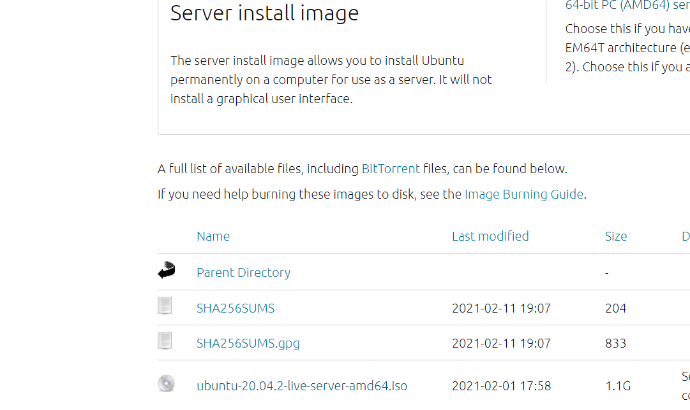
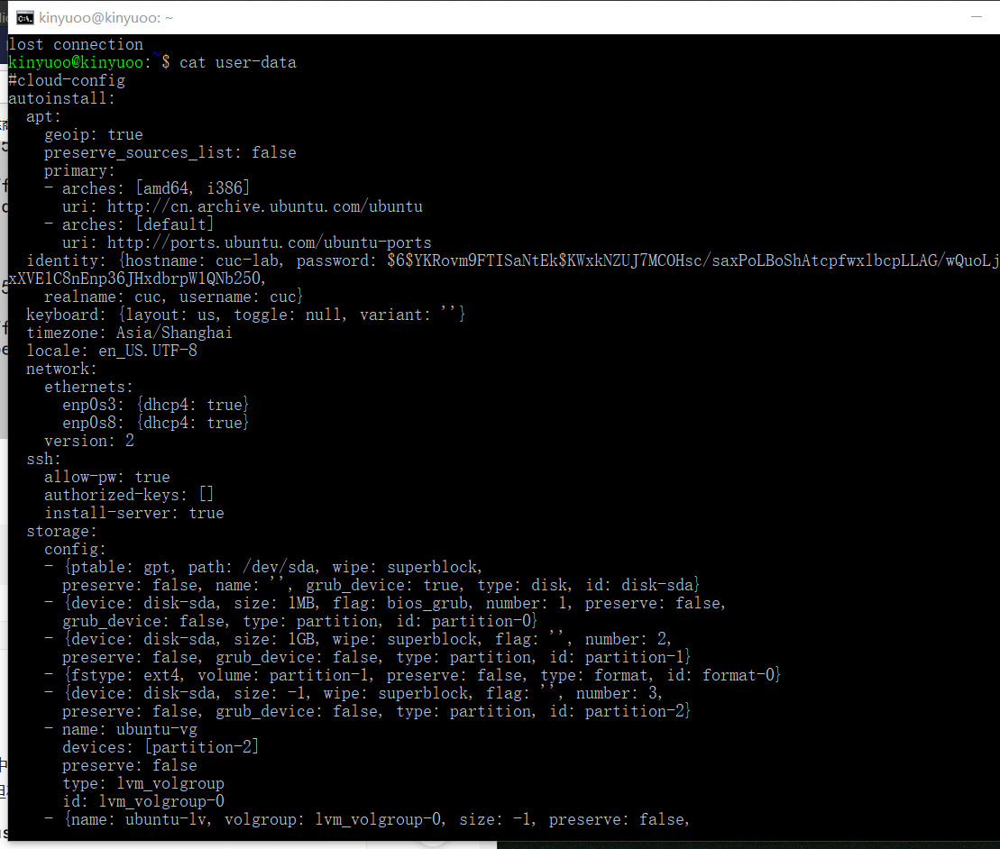

# 无人值守安装镜像实验报告 
## 一、实验环境 
+ Windows 10
+ VirtualBox 
+ Ubuntu 20.04 Server 64bit
## 二、实验目的
配置无人值守安装iso并且在VirtualBox中完成自动安装
## 三、实验步骤
### 1.在官网下载ubuntu-20.04.2-live-server-amd64.iso；

### 2.ubuntu有人值守安装
+ 打开VirtualBox新建虚拟电脑，输入名称，类型选择Linux，版本选择Ubuntu(64-bit)；


+ 之后默认操作，分配给虚拟电脑的内存尽量大一些；

+ 设置-存储-添加下载好的ubuntu-20.04.2-live-server-amd64.iso；


+ 设置双网卡；


+ 启动虚拟电脑；


+ 一路默认done操作，设置用户名/密码，记得勾选Install OpenSSH sever，完成有人值守安装；


### 3.制作无人值守安装镜像
+ ip a语句查找ip地址；


+ 在主机打开cmd,通过ssh连接Linux；


+ 通过ssh在虚拟机创建一个meta-data；


+ 在老师提供的课件仓库下载user-data,查看user-data；


+ 退出ssh连接，在主机cmd将user-data传到虚拟机；


+ 重新建立ssh连接,使用user-data和meta-data制作init.iso；


+ 在主机对应文件夹可见init.iso文件；


### 4.ubuntu无人值守安装
+ 再新建一个虚拟电脑；


+ VirtualBox设置-存储-移除【控制器：ide】，后在【控制器：SATA】下新建两个虚拟光盘，按顺序挂载【纯净版Ubuntu安装镜像文件】后挂载【init.iso】；


+ 启动虚拟电脑，稍候，出现“Contiune with autoinstall?(yes|no)”，填写yes；


安装完毕。
+ 同样地，配置双网卡，尝试添加第三块；

+ 自动获取ip地址；
```linux
sudo vim /etc/netplan/00-installer-config.yaml

sudo netplan apply
```
+ 重启虚拟电脑，输入ifconfig,新添加得网卡实现系统自动启用和自动获取ip。

## 问题及解决
1. 问题1：原本建了一个clone目录，将user-data和meta-data放在下面，但建init.iso时显示


解决办法：
忽略clone目录,直接通过ssh在虚拟机mkdir-meta-data建一个meta-data文件


再将主机的user-data发到虚拟机上，发送过程中也遇到了问题，换到[以管理员身份运行]后发送；

然后生成init.iso;

2. 问题2:
新建无人值守虚拟机的时候，启动后出现“FATAL:No bootable medium found!”

之前下载好并正常使用的ubuntu文件变成133.33MB大小

解决办法：
重新下载了ubuntu-20.04.2-live-server-amd64.iso（3）并完成挂载；
3. 问题3：
git clone报错`Permission denied (publickey)``fatal: Could not read from remote repository.`
解决办法：[帮助链接](https://blog.csdn.net/ywl470812087/article/details/104459288)
## 参考资料
- [同学报告](https://github.com/CUCCS/2021-linux-public-Stephaniesuu/tree/chap0x01/chap0x01)
- [课件](https://github.com/c4pr1c3/LinuxSysAdmin/blob/a3c3ed18cf38b9e4be1ea53b46efe7f02e4ab8b5/chap0x01.exp.md)
- [帮助链接](https://blog.csdn.net/ywl470812087/article/details/104459288)
